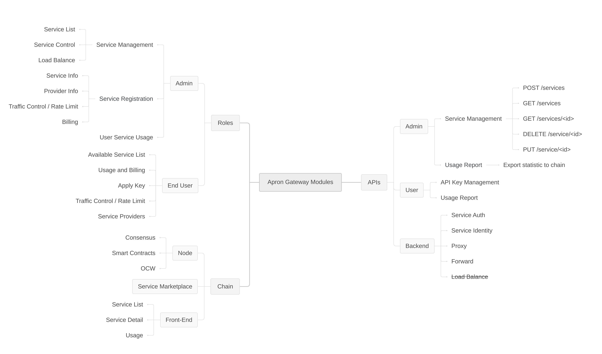
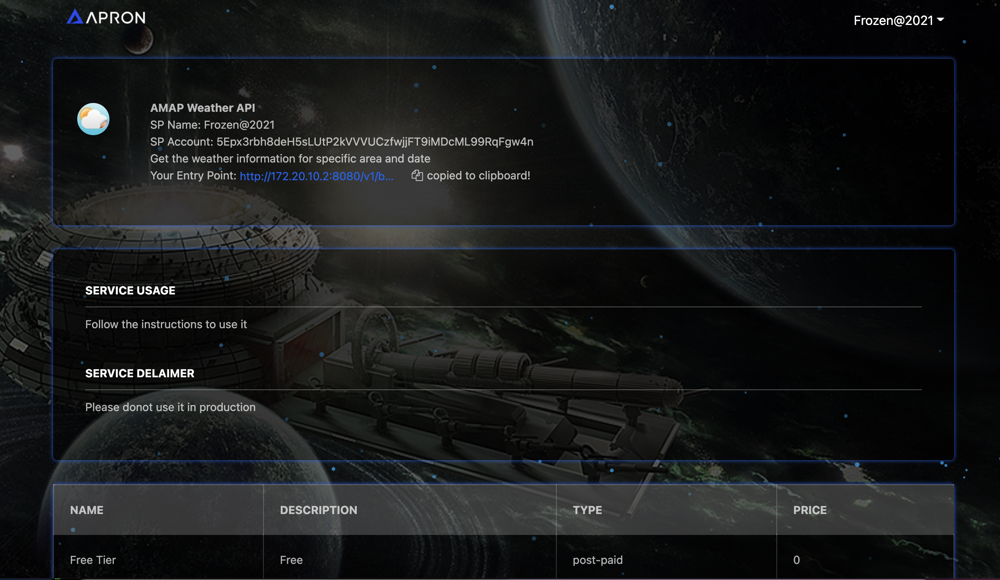
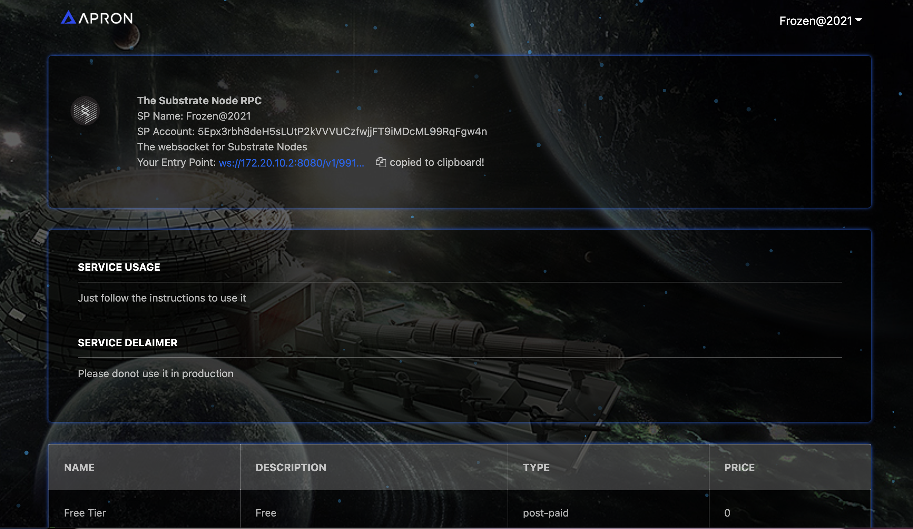
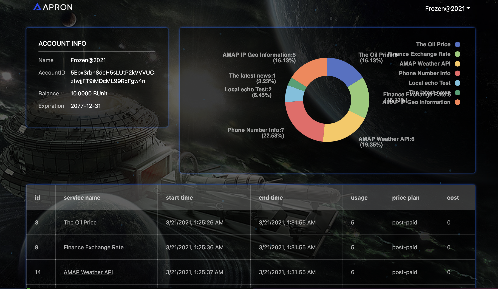
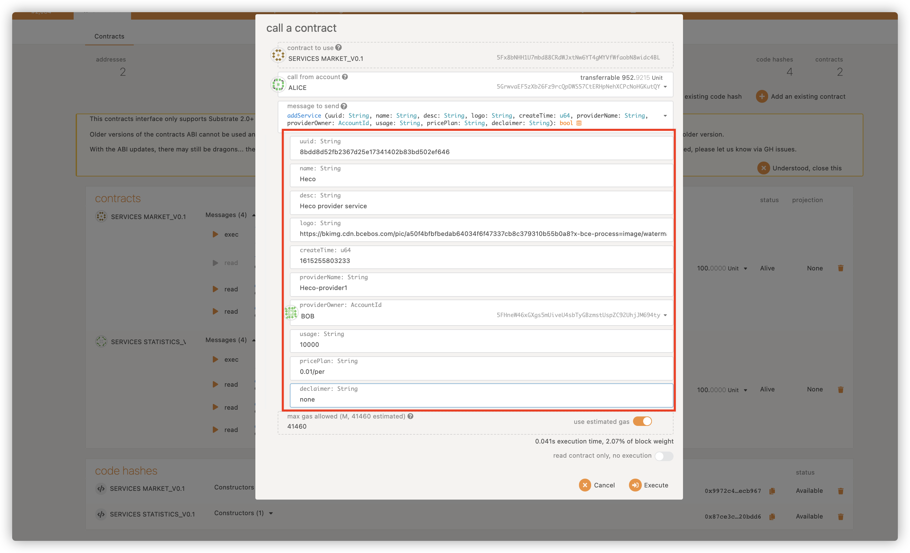
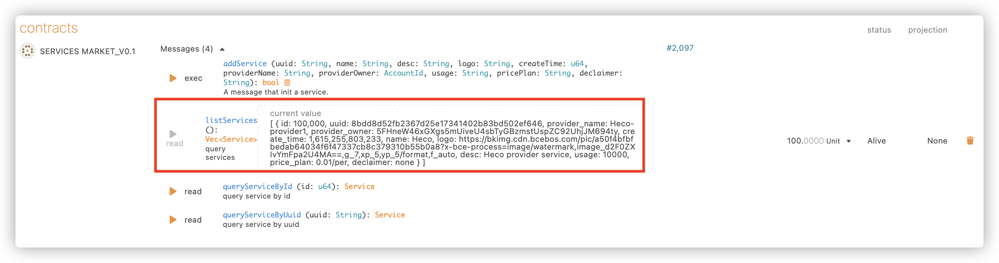
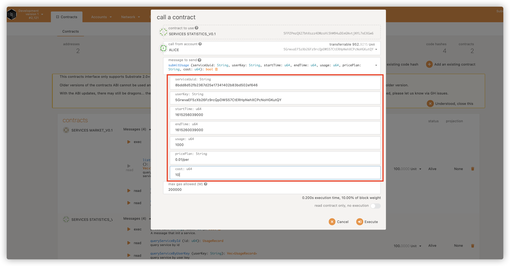

## Overview


Contract Repo: [https://github.com/Apron-Network/apron-contracts](https://github.com/Apron-Network/apron-contracts)   
Apron Node Repo: [https://github.com/Apron-Network/apron-node](https://github.com/Apron-Network/apron-node)   
Apron Gateway Repo: [https://github.com/Apron-Network/apron_gateway](https://github.com/Apron-Network/apron_gateway)   
Apron Deployer Repo: [https://github.com/Apron-Network/apron-deployer](https://github.com/Apron-Network/apron-deployer)  
Apron Market Frontend: [https://github.com/Apron-Network/apron-marketplace-demo](https://github.com/Apron-Network/apron-marketplace-demo)

The demo contains apron node, apron gateway, frontend and contracts. The Apron Node is built with Substrate Framework with contracts and OCW enable. The Apron Gateway is buit  from scratch with Golang, provides dedicated functions for the Apron Network to collect the usage of each service and put the statistics data on chain.



## Docker

You can use built image. We also provide docker file to build docker image from scratch and docker compose file to run the demo.

### Use Built Image

#### Download Docker Image
Please download the latest from here:

`https://drive.google.com/drive/folders/1W9X3BAYs9mU2VuBsnPd2axxRtPkXS9co?usp=sharing`

#### Load Docker Image

```
docker load < apron-node-2021xxxx.tar.gz
```

#### Start 

Get the `docker-compose.yml` from `https://raw.githubusercontent.com/Apron-Network/apron-node/master/scripts/docker-compose.yml`

Run
```
docker-compose up -d
```

**OR**

You can clone the Apron Node repo by run `git clone https://github.com/Apron-Network/apron-node.git`.

And switch to the `script` folder.
```
cd apron-node/script
docker-compose up -d
```

#### Connect Apron Node
Polkadot JS Apps is integrated into Docker image. Access the frontend from here http://localhost:3001/.

Fill in the configuration in `Setting -> Developer`
```
{
  "Address": "AccountId",
  "LookupSource": "AccountId"
}
```

### Docker Image from scratch

#### Build Docker Image
You can build docker image directly. Please clone the Apron Node repo by run `git clone https://github.com/Apron-Network/apron-node.git`.

```
cd apron-node/script
docker build -t apron-node .
```

#### Start
```
cd apron-node/script
docker-compose up -d
```

#### Connect Apron Node
Polkadot JS Apps is integrated into Docker image. Access the frontend from here http://localhost:3001/.

Fill in the configuration in `Setting -> Developer`
```
{
  "Address": "AccountId",
  "LookupSource": "AccountId"
}
```


## Contracts

The Services Market is the Apron that registers the node service, provides the service registration and the query, the following figure is the registration of a new node service.

Services Statistics records the availability and usage of a service over a period of time, and can submit the service usage provided by the service provider to a peer-to-peer contract. Note that only the service registrant using the same account can submit the service usage.

### Deploy contracts with `apron-deployer`

Get the `apron-deployer` from `git clone https://github.com/Apron-Network/apron-deployer.git`

```
cd apron-deployer
yarn 
yarn run deploy
```
You will get several files generated. `marketAddress` is the address for market contract. `statAddress` is the address for statistics contract. These addresses will be used in next step.

## Marketplace Front End
Marketplace Front End is the frontend for Apron Marketplace. And the `Polkadot JS Extention` is supported. So, please install `Polkadot JS Extention` before you start.
You can get it from here [https://polkadot.js.org/extension/](https://polkadot.js.org/extension/)

### Build
Get `marketplace frontend` from `git clone https://github.com/Apron-Network/apron-marketplace-demo.git`

```
cd apron-marketplace-demo
yarn
```

Open the file `public/js/contractAddress.js`, you will see
```
const mainAddress = {
    market: "xxxx" ,
    statistics:'xxxx',
    basepath:'127.0.0.1',
    name:'Apron'
};
window.mainAddress = mainAddress;
```

Please fill the `market` with the address from `marketAddress` mentioned in pre-step. Please fill the `statistics` with the address from `statsAddress` mentioned in pre-step.
Please fill the `basepath` with the ip of the machine which runs `apron-node`.

### Run
```
cd apron-marketplance-demo
yarn run start
```

And you will able to open `localhost:3000` in Chrome/Firefox.

The initial pages are empty, since there is no services avaiable yet. Please follow the rest of this tutorial to see the complete steps, or please check this demo video . [video file](https://raw.githubusercontent.com/Apron-Network/materials/main/tutorials/video/apron-demo.mov)

The frontend will be like below:

Market place


Service detail - AMAP Weather


Service detail - Substrate Node RPC


My Services List as Service Provider


My Statistics as Service User


## Demo
The scripts to run a complete demo of Apron Network are included in `apron-deployer`.

With all previous steps finished and the containers running, you can start the demo now. Please start the following demo scripts with three terminals.

```
cd apron-deployer
yarn run watch
```

```
cd apron-deployer
yarn run submit
```

```
cd apron-deployer
python3 hackathon_demo.py
```

Now, you can open the `Marketplace Front End` again, and click `+Add New` to add the service as you like. 

Here are some samples you can use directly
```
Name
AMAP IP Geo information

Logo Link
https://ss1.bdstatic.com/70cFvXSh_Q1YnxGkpoWK1HF6hhy/it/u=3188313520,1846855615&fm=11&gp=0.jpg

Base URL
restapi.amap.com/v3/ip

Schema
http
```

Test cmd `http <the link you get from marketplace> key=808358ce5c8e5a03eb49da38c26ca71a&ip=114.247.50.2`

## Use Contract

### Use through `Polkadot JS Apps`
#### Services Market Module

The Services Market is the Apron that registers the node service, provides the service registration and the query, the following figure is the registration of a new node service.



All registered services can be queried through listService.




#### Services Statistics Module

Services Statistics records the availability and usage of a service over a period of time, and can submit the service usage provided by the service provider to a peer-to-peer contract. Note that only the service registrant using the same account can submit the service usage.




### Use with 

