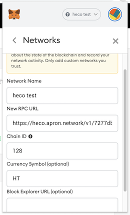

# Tutorial

Apron Network tried to setup a test environment with prototype for Huobi Eco Chain.

Here is a tutorial of how to use Apron Network with **Metamask** the wallet for Ethereum.

### Step 1

Open [https://dashboard.apron.network](https://dashboard.apron.network) with explorer, and finsih registration with email.  

### Step 2

1. Click **Heco Icon** in the left panel.
1. Click **CREATE NEW PROJECT** on the right corner.
1. Input the your project name and click **CREATE**

### Step 3 

1. Click the project in your project list
2. Find the **ENDPOINT** in the project details page
3. Click the **copy** icon at the end of **https** entry point

### Step 4

1. Open your metamask
2. Click the network drop list on the left of your account avatar
3. Choose **Custome RPC**
4. Fill in `New RPC URL` with the **https** url copied in **Step 3**
5. Fill in `Network Name` with any name you want
6. Fill in `Chain ID` with **128** which is the mainnet chain id of Heco
7. Fill in `Currency Symbol` with **HT** which is the symbol for Heco
8. Scroll down and click **Add Network**

### Step 5

1. Click the network drop list on the left of your account avatar
2. Choose the network you add in **Step 4**